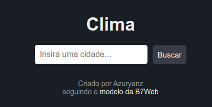
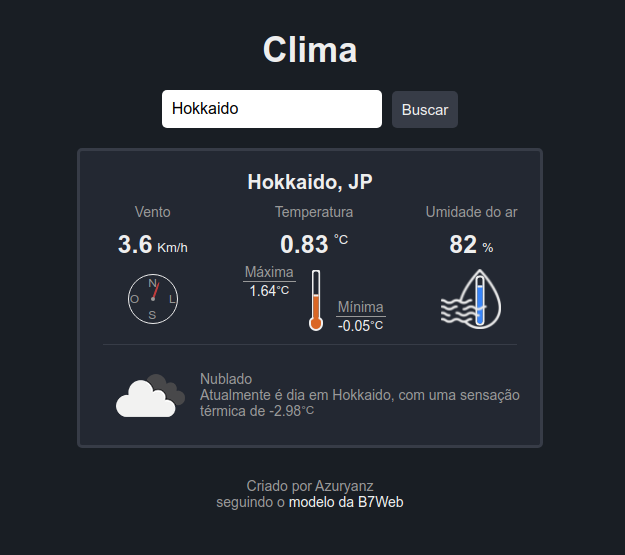
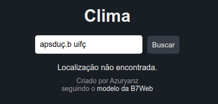

<h1 align="center">Clima</h1>

## Sobre o Projeto
O projeto original é de autoria da B7Web, e a vídeo-aula mostrando como desenvolver o projeto base pode ser encontrada [aqui](https://alunos.b7web.com.br/curso/javascript/d7js-projeto-3-clima).

Apesar de a vídeo-aula ter o foco voltado apra o ensino de JavaScript, por motivos de prática, todo o **HTML** e **CSS** foi desenvolvido por conta própria, apenas visualizando o layout do projeto original.
Essa aula em especial utiliza de uma API do [OpenWeather](https://openweathermap.org/) para a busca e obtenção de dados.

Além dos elementos desenvolvidos no projeto original, a fim de se explorar mais a api e desenvolver as habilidades em Html, CSS e JavaScript, temos:
- Em geral, maior personalização das informações mostradas em tela;
- Maior quantidade de informações, como umidade do ar, diferentes temperaturas e período do dia;
- Re-organização dos elementos dispostos em tela.

## Como utilizar
### Abrindo o arquivo
Uma vez que o projeto utiliza apenas de HTML, CSS e JavaScript, basta o usuário abrir o arquivo **index.html** em um navegador, que tela da bateria será carregada.

### Fazendo uma busca

Para iniciar uma busca, o usuário deve digitar o **nome de uma cidade** no campo de busca, e em seguida deve **apertar** o botão *Buscar* ou **pressionar** a tecla *enter* em seu teclado.

### Busca bem sucedida

Caso o usuário insira uma cidade **válida**, será retornado para a tela um card contendo diversas informações sobre a cidade em questão.

para buscar informações do clima de outra cidade, basta repetir o processo.

### Busca falha

Caso o usuário tenha inserido uma cidade **inválida**, nenhum card será exibido, mas apenas a mensagem de erro.

### Buscas na API
Como este projeto tem a finalidade de estudo, foi utilizada uma conta gratuita no site do OpenWeather. Assim, tem-se as seguintes limitações de uso:
- Máximo de *60 buscas* por minuto;
- Máximo de *1 milhão* de buscas totais por mês.
